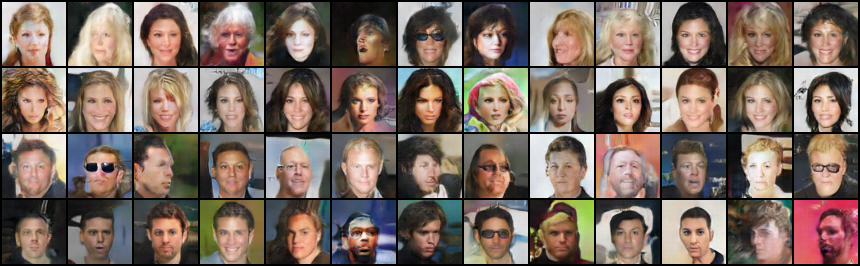

## Generating human faces using Conditional Generative Adversarial Networks (cGAN)

We deployed cGAN on celebA dataset which contains over 220000 celebrities faces. The final model sucessfully generated 4 different classes:
- Old women
- Young women
- Old men
- Young men


```python
from IPython.display import Image
Image('Generate/generated_samples.png')
```





### Training
Please use cond_GAN.py for training. The model that generated the above pictures was trained using following command:

python cond_GAN.py --cuda --ngpu 2 --ngf 128 --ndf 128 --nz 50 --emb_size 50 --lr 0.001 --niter 10
